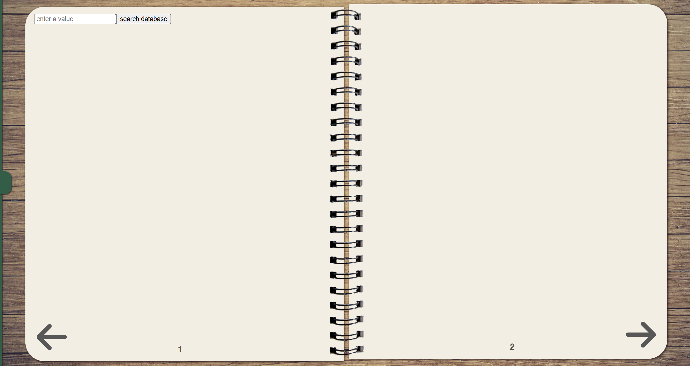
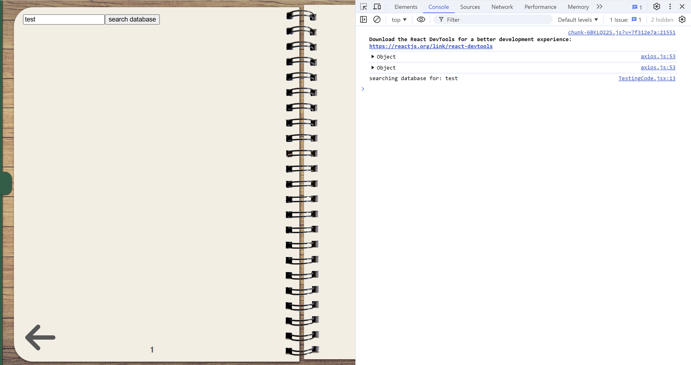

## Table of Contents
1. [Program Overview](#program-overview)
2. [General Overview](#general-overview)
3. [Setting Up the Project](#setting-up-the-project)
4. [Database Explanation](#database-explanation)
   - [MongoDB](#mongodb)
   - [PostgreSQL](#postgresql)
5. [Security Features](#security-features)
6. [Custom JSON Object Structures](#custom-json-object-structures)
7. [Notebook.jsx Explanation](#notebookjsx-explanation)

# Program Overview
Hi! I'm Mackenzie Neill, a COIS student at Trent University. This is a personal project I've been working on to sharpen my web development skills beyond coursework. It's been a great learning experience in full-stack development, cybersecurity, and server management. If you have questions, feedback, or suggestions, feel free to reach out at mackenzie.neill.359@gmail.com.

## General Overview
Author: Mackenzie Neill 
Start date: December 15th, 2023

Tech Stack
 - Frontend: React (TypeScript) 
 - Backend: Node.js
 - Database: MongoDB (cloud-hosted) and PostgreSQL (local)

### Setting Up the Project
 1. Open the `run_website.txt` file in the root directory.
 2. Set the URL to the path where you saved this project.
 3. Save the file with a `.bat` extension.
 4. Double-click the `.bat` file to run the application.

Note: The application will run, but no data will be accessible until the databases are properly configured. Refer to the [Database Explanation](#database-explanation) section for more details.

## Database Explanation
There are two databases I'm using for this project, I created some relational diagrams to show what's going on.

### MongoDB
The MongoDB database is cloud-hosted. To run the project locally:

 - Create your own MongoDB cluster online.
 - Update the connection string in `server/config/connectMongo.js`.

That's it, collections and schemas are auto-generated on first run.

Note: MongoDB supports nested JSON objects, which don't translate cleanly to relational diagrams. Any field labeled "nested" refers to embedded subdocuments, not actual independent objects.


### PostgreSQL
This is the PostgreSQL server, containing data from the Canadian Nutrient File. The software runs locally on the machine you're running the server on and requires manual setup. Setup instructions can be found in:

`canadian-nutrient-file/Ingredient Database Instructions.txt`


## Security Features
- HTTPS connection
- HTTP-only cookies
- Sanitization of all client input (cookies, query, params, and body)

### User Authentication
- JSON web tokens (JWT)
- Access token that lasts 15 minutes
- Refresh token that lasts 30 days

### Password Protection Features
Client side:
- Password masking
- User must enter their password twice to verify they entered it correctly
- (Planned) Add minimum password requirements

Server side:
- Passwords are salted and hashed before storage


## Custom JSON Object Structures
Any JSON object being sent from the server to the client should follow one of these patterns

### foodGroupObject
```js
{
   foodGroupId: number, //primary key
   foodGroupName: string
}
```

###  ingredientObject
```js
{
   foodId: number, //primary key
   foodDescription: string,
   portion?: {
      measureId: number,
      measureDescription: string,
      amount: number
   },
   nutrition?: {
      calories: number,
      fat: number,
      cholesterol: number,
      sodium: number,
      potassium: number,
      carbohydrates: number,
      fibre: number,
      sugar: number,
      protein: number
   }
}
```

### recipeObject
```js
{
   _id: mongoose.SchemaTypes.ObjectId,
   owner: mongoose.SchemaTypes.ObjectId,
   title: string,
   description: string,
   image: string, // to be changed
   ingredients: Array<ingredientObject>, // must include portion and nutrient field 
   instructions: Array<string>,
   nutrition: {
      calories: number,
      fat: number,
      cholesterol: number,
      sodium: number,
      potassium: number,
      carbohydrates: number,
      fibre: number,
      sugar: number,
      protein: number
   }
}
```

### userObject
```js
{
   _id: mongoose.SchemaTypes.ObjectId,
   username: string,
   email: string,
   bio: string,
   relationship?: {
      _id: mongoose.SchemaTypes.ObjectId,
      type: number
   }
}
```

### userFolderObject
```js
{
   _id: mongoose.SchemaTypes.ObjectId,
   folders: Array<userFolderObject | mongoose.SchemaTypes.ObjectId>,
   users: Array<userObject | mongoose.SchemaTypes.ObjectId>
}
```


IM WORKING ON THIS DON'T READ YET
## Notebook.jsx Explanation 
location: (client/src/components/Notebook.jsx)

there are 3 crucial parts of notebook that anyone using the component should be aware of:
- blank space
   - the space on each page that is left empty, that will be filled in by the component calling notebook
- arrow buttons
   - two large arrows that the user can click to flip between pages
   - arrow keys and A/D keys will also allow the user to flip through pages
- page number
   - a number at the bottom of each page that displayed to the user the page that they are on

The following is what notebook.jsx looks like without any props being provided: \


There are 3 props that notebook accepts when being called
- pageList
   - required prop
   - used to display any html that should appear inside the notebook
- parentPageNumber
   - optional prop
   - decides the value of the first page being provided to notebook
- requestNewPage
   - optional prop
   - a function that will be called in the event that the user tries to access a page that does not currently exist

### pageList - required prop
pageList is an array of JSON objects, each JSON object inside pageList represents and page that Notebook.jsx should be displaying. The array should look something like this:
```js
[
   { /*page one*/ },
   { /*page two*/ },
   { /*page three*/ }
   // add as many pages as you need
]
```

At any given time, Notebook.jsx will display up to two pages. A page that is being displayed will have it's content shown in the gree box:\


There are two parts to each JSON object inside pageList:
- content
   - a react function that can be called in like any other component
   - contains all page content
- props
   - a JSON object
   - contains all data being passed from the component calling notebook to the component being referenced in this object

All JSON objects inside pageList should look like this:
```js
{
   // the content of the page you want notebook.jsx displaying
   content: ReactComponent,
   // any props the individual component needs to work properly
   props: {
      // you can change the name of the prop as you pass it to Notebook.jsx, however for simplicity the documentation will keep the prop names consistent
      propOne: propOne,
      propTwo: propTwo
      propThree: propThree
      // add as many props as you need
   }
}
```

this is all the information you need to understand how page list works, now the documentation will provide some example code.

#### example code (one page)
some simple code that demonstrate's how to use NoteBook.jsx to render a notebook with one page inside it

calling Notebook.jsx to only display one page should look like this:
```js
import React, {useState} from 'react';
import Notebook from "../components/Notebook";

// this is the main function that is being exported
// this is the function that will calls notebook
export default function MainFunction() {

   // create a use state for testing the component
   const [search, setSearch] = useState('');

   // create a function for testing the component
   function searchFunction() {
      console.log('searching database for:', search);
   }

   const pageList = [
      // JSON object for the page
      {
         content: PageOne,
         props: {
            // pass down the useState
            search: search, 
            setSearch: setSearch,
            //pass down the function
            searchFunction: searchFunction
         }
      }
   ];

   // call the Notebook and make sure to pass pageList 
   return <NoteBook pageList={pageList} />
}

// function containing the content of the page you want to display
function PageOne({ search, setSearch, submitSearch }) {
   // use the props being passed down 
   return (
      <div>
         <input
            value={search} 
            onChange={ (event) => { setSearch(event.target.value) } }
            placeholder='enter a value'
         />
         <button
            onClick={ () => { submitSearch() } } 
         >
            search database
         </button>
      </div>
   )
}
```
The following are the important portions of the code:
- there are two react components in this code
   - MainFunction - the parent function
   - PageOne - the child function
- pageList is defined inside the parent component, and has the child components are called inside the pageList array as an indexes content
- Variables and functions defined inside the mainPage component, can be used by the PageOne component, as long as they are passed down as props
- all actual html you want shown inside notebook is defined inside the child component

the resulting page should look like this: \

and when the button is clicked a the console will log a message: \


#### example code (three pages)
The main usefulness for Notebook.jsx is displaying multiple pages of information at once.

Using Notebook.jsx to display 3 pages should look something like this: \
```js
import React, {useState} from 'react';
import Notebook from "../components/Notebook";

// this is the main function that is being exported
// this is the function that will calls notebook
export default function MainFunction() {

   // create a use state for testing the component
   const [search, setSearch] = useState('');

   // create a function for testing the component
   function searchFunction() {
      console.log('searching database for:', search);
   }

   const pageList = [
      // JSON object for the first page
      {
         content: PageOne,
         props: {
            // pass down the useState
            search: search, 
            setSearch: setSearch,
            //pass down the function
            searchFunction: searchFunction
         }
      },
      // JSON object for the second page
      {
         content: PageTwo,
         // this page requires no props, so just pass an empty json object
         props: {}
      },
      // JSON object for the third page
      {
         content: PageThree,
         props: {
            text: "this is the third page"
         }
      }
   ];

   // call the Notebook and make sure to pass pageList 
   return <Notebook pageList={pageList} />
}

function PageOne({ search, setSearch, searchFunction }) {
   // use the props being passed down 
   return (
      <div>
         <input
            value={search} 
            onChange={ (event) => { setSearch(event.target.value) } }
            placeholder='enter a value'
         />
         <button
            onClick={ () => { searchFunction() } } 
         >
            search database
         </button>
      </div>
   )
}

function PageTwo() {
   // no props given by parent, so lets create our own variables

   // create useStates for testing the component
   const [userInput, setUserInput] = useState('');
   const [text, setText] = useState('');
   // create a function for testing the component
   function searchFunction() {
      setText(userInput);
   }

   return (
      <div>
         <input
            value={userInput} 
            onChange={ (event) => { setUserInput(event.target.value) } }
            placeholder='enter a value'
         />
         <button
            onClick={ () => { searchFunction() } }
         >
            Search value
         </button>
         <p>now searching for: {text}</p>
      </div>
   )
}

function PageThree({ text }) {
   // display the text given by parent through props
   return (
      <div>
         <h1>Third page</h1>
         <p>{text}</p>
      </div>
   )
}
```

The following are the important portions of the code:
- pageList now has 3 JSON objects, each representing one page
- as shown when adding pageTwo to pageList, if you don't want to assign any props to a page you can just set props to {}
