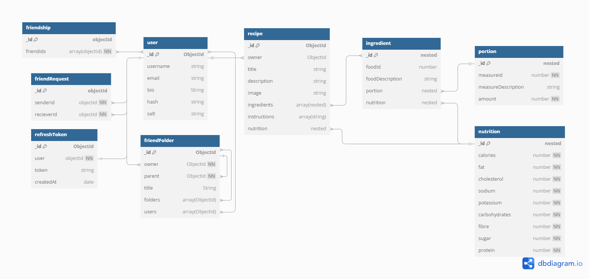
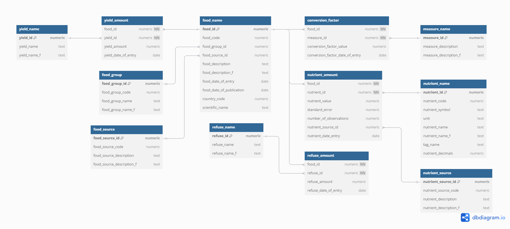

# Beill's Greenhouse
*A showcase project demonstrating web-development, networking, and cybersecurity skills.*

Beill's Greenhouse is a personalized project created by Mackenzie Neill, a graduate of Trent University's Computer Science program. This project serves as a platform to explore and refine skill's in web-development, networking, and cybersecurity. As an experimental project, it's a continuous work in progress and isn't being actively monitored for security vulnerabilities. Consequently, data protection is limited, and users should exercise caution when using the application.

## General Overview
Author: Mackenzie Neill 
Start date: December 15th, 2023

### Features
   - Create, read, update, and delete recipes
   - User authentication (JWT, bcrypt password hashing)
   - Responsive design (works on desktop + mobile)
   - Deployed on Vercel + Render
   - RESTful API design

### Tech Stack
   - Frontend: React, TypeScript, SCSS, Vite
   - Backend: Node.js, Express.js
   - Database: MongoDB, PostgreSQL
   - Auth: JSON Web Tokens (JWT), bcrypt
   - Deployment: Vercel (frontend), Render (backend)

## Security Features
   - HTTPS connection (only on cloud deployment)
   - HTTP-only cookies
   - Sanitization of all data from clients (cookies, query, params, and body)

Originally I did have this code configured manually to use HTTPS connections. 
However, both render and vercel automatically convert HTTP messages to HTTPS for me.

### User Authentication
   - JSON web tokens (JWT)
   - Access token that lasts 15 minutes
   - Refresh token that lasts 30 days

### Password Protection Features
Client side:
   - Password masking
   - User must enter their password twice to verify they entered it correctly
   - Minimum password requirements

Server side:
   - Passwords are salted and hashed before storage

## Database Design
This project uses two databases:

   - **MongoDB** is used to store larger and more dynamic data in a remote, cloud-hosted environment.
   - **PostgreSQL** stores a small amount of static data that needs to be accessed quickly. It is kept local, next to the server.

I have created some relational diagrams to illustrate the structure and relationships within these databases.

### MongoDB
The MongoDB database is cloud-hosted.

> **Note:** MongoDB supports nested JSON objects, which don’t translate cleanly into relational diagrams. Any field labeled “nested” refers to embedded subdocuments, not independent objects.



### PostgreSQL
This is the PostgreSQL server, containing data from the Canadian Nutrient File. The software runs locally on the machine you're using to run the server and requires manual setup. Setup instructions can be found in:

`/canadian-nutrient-file/DB_Setup.md`



## Setting Up the Project
Some simple steps for setting this project up in your own local environment:
1. Open the `run_website.txt` file in the root directory.
2. Set the URL to the path where you saved this project.
3. Save the file with a `.bat` extension (or respective file type if you're not using windows).
4. Inside the `client` folder, create a `.env` file and add:
```
VITE_SERVER_LOCATION=http://localhost:4000
```
5. Inside the `server` folder, create a `.env` file and add:
```
SESSION_SECRET=
LOCAL_ENVIRONMENT=true
```
6. Fill in a value for `SESSION_SECRET` (choose a strong secret).

Next, setup mongoDB:
1. Create your own MongoDB cluster online.
2. Update the connection string in `server/config/connectMongo.js`.
3. Add the following line to the server’s `.env` file:
```
MONGO_DB_PASSWORD=
```
4. Fill in your MongoDB password.

Finally, setup Postgres:
1. Go to `/canadian-nutrient-file/DB_Setup.md` for instructions and code.

Run the `.bat` file and you're good to go