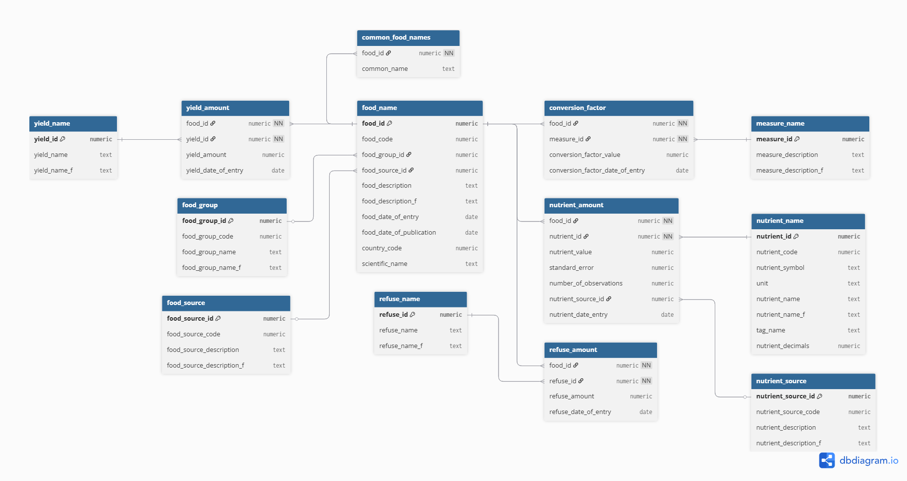

## Database Design
This project uses two databases:

   - **MongoDB** is used to store larger and more dynamic data in a remote, cloud-hosted environment.
   - **PostgreSQL** stores a small amount of static data that needs to be accessed quickly. It is kept local, next to the server.

### MongoDB
The MongoDB database is cloud-hosted. Its used to store dynamic data inside the website. Users, Recipes, and Friendships can be found inside the mongoDB database

#### Relational Diagram

> **Note:** MongoDB supports nested JSON objects, which don’t translate cleanly into relational diagrams. Any field labeled “nested” refers to embedded subdocuments, not independent objects.

### PostgreSQL
This is the PostgreSQL server, containing data from the Canadian Nutrient File. The software runs locally on the machine you're using to run the server and requires manual setup. Setup instructions can be found in:

> **NOTE:** the setup instructions can be found inside `/canadian-nutrient-file/DB_Setup.md`

#### Relational Diagram
